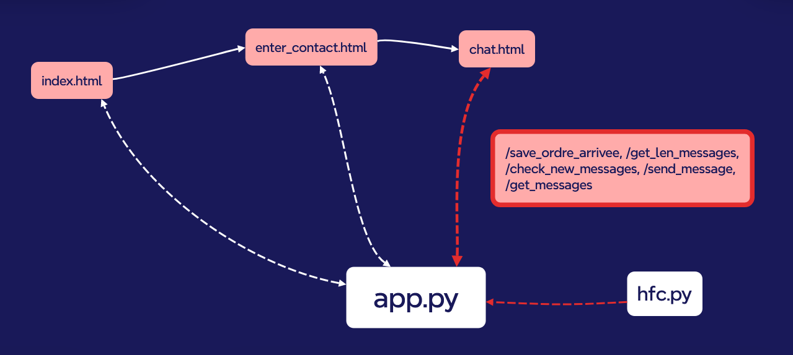

# Documentation du projet Pote ou bot

## Carte mentale pour comprendre le lien qu'ont les fichiers entre eux et comment ils fonctionnent



## Description fonctionnelle du projet par rapport au cahier des charges

Actions possibles de l'utilisateur dans les paramètres selon le cahier des charges :

- Créer une partie

Dans la version finale de notre programme, il n'est pas question de "parties". Puisque la messagerie instantanée 
concerne uniquement 2 personnes et jamais plus, nous avons opté pour une solution plus simple qui consiste à rentrer
un pseudo puis rentrer le pseudo de celui avec qui nous voudrions rentrer en contact. Si les 2 personnes font cela, alors
le contact s'établit dans une page chat.html à laquelle elles seront redirigées automatiquement.
  
- Inviter/rejoindre un autre participant

Il n'y a donc pas d'invitation non plus, le site web est pensé pour être joué en amis et il est particulièrement amusant
(et donc pensé pour) lorsque les amis sont dans le même lieu, dans quel cas il n'y a pas besoin d'un système d'invitation.

- Envoyer des messages et répondre en temps réel

La messagerie instantanée est fonctionnelle.

- Déterminer si son interlocuteur est un robot ou un humain

Le système du jeu propose bien à celui qui doit deviner l'identité de son interlocuteur si il pense avoir parlé à un
"pote" ou un "bot".

---

Actions de l'ordinateur selon le cahier des charges :

- Héberger des « rooms » (espace de discussion entre 2 joueurs)
- Choisir si l’interlocuteur sera un humain ou une IA
- Gèrer la discussion instantanée en faisant un lien à
une IA grâce à une API

Toutes ces actions prévues pour l'ordinateur ont bien été réalisées.

---

La fonction la plus importante pour saisir la logique du code est dealWithTheFlow :

```

        function dealWithTheFlow() {
            fetch('/check_new_messages', {
                method: 'POST',
                headers: {
                    'Content-Type': 'application/json'
                }
            })
            .then(response => response.json())
            .then(data => {
                const newMessagesReceived = data.newMessagesReceived;
                if (newMessagesReceived) {
                    fetch('/get_len_messages', {
                        method: 'POST',
                        headers: {
                            'Content-Type': 'application/json'
                        }
                    })
                    .then(response => response.json())
                    .then(data => {
                        const longueur = data.len; // Récupère la longueur de la liste de messages
                        countdownValue = 21; // Remet le compte à rebours à 21 lors de la réception d'un nouveau message
                        // Ne pas oublier le message automatique
                        // + Nombre pair pour allonger la discussion
                        if (isDevineur() && longueur < 10) {
                            unblockInterface();
                            devineurMessageFlow();
                        }

                        if (isPote() && longueur <= 10) {
                            unblockInterface();
                            poteMessageFlow();
                        }

                        if (isBot() && longueur <= 10) {
                            botMessageFlow();
                        }


                        if (isDevineur() && longueur === 11) {
                            sendSystemMessage();
                            unblockInterface();
                            devineurMessageFlow();
                        }

                        if ((isPote() || isBot()) && longueur >= 13) {
                            sendRoleMessage();
                            blockInterface();
                        }
                    });
                }
            });
        }

```

Cette fonction permet de gérer beaucoup de choses : l'envoi de messages tour à tour, seulement en cas de réception de nouveaux messages, en fonction des rôles de chacun et du progrès de la discussion (plus ou moins longue).


